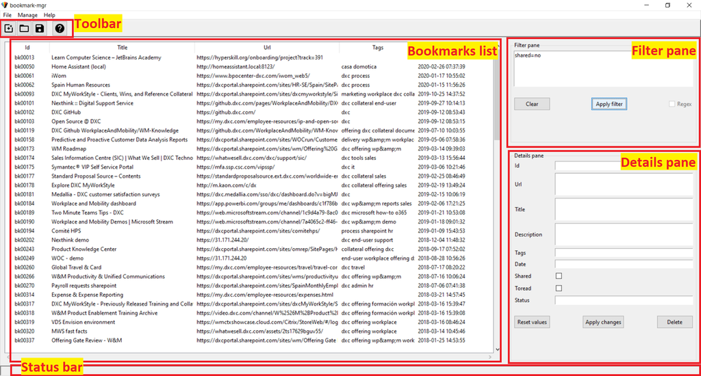

# User manual for bookmark_mgr

## Table of contents

1. [Presentation](#presentation)
2. [Screen description](#screen-description)
3. [Menus](#menus)
4. [Toolbar](#toolbar)
5. [Other functions](#other-functions)

## Presentation

The reason why I started this project is to practice with python and tkinter, making use of a public API such as pinboard. Besides that, I always find, in general in any service, the use of tags for filtering the results is very poor: it is often difficult to filter using several tags, and almost impossible to use the NOT tag (as in: show me elements that have the tag *python* but don't have *tkinter*). So my intention here is to develop a search functionality allowing this more powerful search, similar to the syntaxis used by google when searching emails in gmail, for example.

So the idea is to use this program to download your bookmarks from [pinboard][pinboard_lnk], manage and edit them locally more easily, and then synchronize these changes with the web again. A copy of the bookmarks is kept locally, so you only synchronize the changes since the last connection.

## Screen description

The main screen is structured as shown in Fig. 1.

_**Fig. 1**. Parts of the main screen_

We have the _toolbar_ at the top, with icons giving quick access to some of the common actions, and the _status bar_ at the bottom, that is used to display messages.

The main part of the screen is the _list of bookmarks_, showing the main attributes for each bookmark: title, url, tags, and time of creation. The _filter pane_ shows a searchbox, to add some filters to reduce the list shown at the left. Examples of such filters are: _"tags=python"_, or _"title=Home"_. A more complete syntax is described in chapter "[Search syntax](#search-syntax)".

And finaly the _details pane_ that shows all the details for the selected bookmark, and allows modification of them.

## Menus

TODO - menus not implemented yet.

### Menu File

This menu holds the file-related functions, such as open, save, etc., and also quit the program. The commands included are:

- **New**: clears current bookmark database from memory, starting an empty one.

- **Open**: open a previously saved file with bookmarks. For now, only JSON format is allowed, but other formats will be implemented in the future (e.g. html, xml).

- **Save**: save current database, in the same filename and format as it was opened.

- **Save as**: allows saving as a different name/folder. For now, only JSON format is allowed.

- **Quit**: quit the application

### Menu Manage

This menu holds the commands related to managing the bookmarks: synchronisation with/from Pinboard, creation of new bookmark, deletion, etc. The commands included are:

- **Get from pinboard**: download all bookmarks from pinboard. This will empty the current loca database, and populate with the information from Pinboard.

- **Update changes to pinboard**: upload all changes that have been done locally to Pinboard: deletions, additions, tags changes, bookmark changes, etc.

- **Add new bookmark**: adds a new bookmark to the database. A new bookmark requires as a minimum the URL to be defined.

- **Delete bookmark**: delete current bookmark. The bookmark is marked for delete in the local database, changing its status to delete. At the next syncrhonisation with Pinboard, it will be actually deleted from the local database and from Pinboard.

- **Rename tag**: rename a tag. This updates all local bookmarks that have the tag with the new tagname, and marks the tag to be renamed at  Pinboard website at next syncrhonisation. The bookmarks' status is not changed to update, as they will not be individually updated but rather using the _tag rename_ api function from Pinboard.

- **Delete tag**: deletes a tag. It follows the same approach as renaming: tag is marked to be deleted at next synchronisation, and removed from all local bookmarks.

- **Save Pinboard API Token**: will allow you to save the API token from Pinboard. This is saved in a local file, and will be used to access pinboard.

### Menu Help

This holds the help functions, credits, etc.

- **Manual**: access to the manual page (this page), explaining how to use the program.

- **About**: shows credits, current version, etc.

## Toolbar

TODO - not implemented yet.

## Other functions

TODO

### Attributes of bookmarks

Most of the attributes of the bookmark come from the definition of pinboard. But there are some attributes added, so we can work with the list offline, and then synchronise with pinboard web. These are the attributes:

- **id**: this is a unique identifier, so we can refer to the bookmark
- **url**: this is the URL itself
- **title**: title of the bookmark, i.e. short text describing the bookmark. By default, this is the page title.
- **description**: longer description or comments about the bookmark
- **tags**: list of tags or keywords associated with the bookmark
- **date**: date and time when bookmark was created. This is in UTC format.
- **shared**: is this bookmark public, i.e. visible to anyone in pinboard? This is a True/False attribute.
- **toread**: bookmark is flagged to be read later, as per [pinboard definition](https://pinboard.in/tour/#later). Again, it is a True/False attribute.
- **status**: this is local attribute, used to know if the bookmark needs to be syncrhonized with pinboard or not. It can have 3 values:
  - _delete_: the bookmark has been deleted locally. It will be deleted in pinboard at next syncrhonisation.
  - _update_: bookmark has changed one or more of its attributes. Changes will be updated to pinboard at next synchronisation.
  - _synced_: bookmark is in sync with information on pinboard, i.e. has not been modified locally.

### Search syntax

The syntax to be used in the search box of the filter pane is quite simple: any field name (as shown above, in lowercase), followed by `=` (equal) or `!=` (different) sign, and the text. If the text has any spaces, put it between "".

The only exception is the date field, which allows only the operators `<` (less than, or earlier than), and `>` (greater than, or later than). Date must be provided in [ISO format](https://en.wikipedia.org/wiki/ISO_8601): `yyyy-mm-ddTHH:MM:SS`, where all the time components are optional, but not the date. Note that all dates are expressed in UTC, but no need to add timezone info.

You can type several times the same field name, and it will be compared against all instances. The comparison is made by searching if the text provided is part of the field (i.e. any portion of the field). At the moment, the comparison is following **AND** logic, i.e. all conditions have to be met, in order to meet the filter. Search is case-sensitive.

The boolean fields (i.e. `toread` and `shared`) can be compared against a yes/no, y/n, or True/False condition. In this case, search is non case-sensitive.

Examples of search filters:

- `tags=python tags!=documentation`: show all bookmarks with the tag _python_, but excluding those with tag _documentation_
- `title="Python for" url!=python.org date>2018-01-01 date<2018-12-31`: all bookmarks with the words _Python for_ in the title, but not belonging to the _python.org_ domain, and bookmarked during 2018.
- `shared=no status=delete`: bookmarks that are privat (e.g. not shared), and its status is set to _delete_, meaning they will be deleted at the next synchronisation with pinboard.

[pinboard_lnk]: https://pinboard.in
